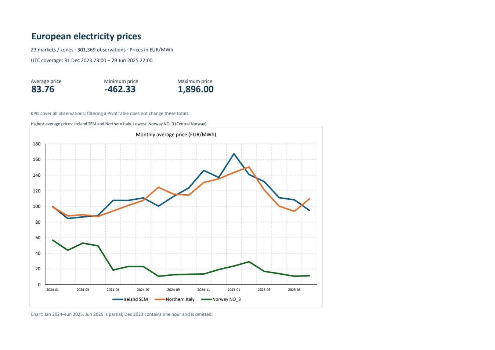
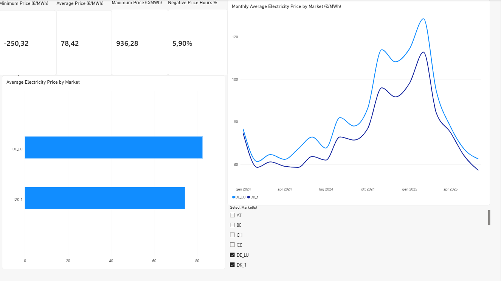

# European Electricity Price Analysis

How much do electricity prices differ across European markets over the January 2024–June 2025 reporting period, how do they change over time, and where do negative prices occur?

This project explores those questions using hourly electricity data, with Power Query for data preparation, SQLite for quality checks and analysis, and Excel and Power BI for reporting.

## Main findings

**Average prices differ substantially across markets.** Ireland (SEM) and Northern Italy (IT_NORD) had the highest average prices in the sample, at **€114.52/MWh** and **€111.41/MWh** respectively. Norway’s NO_3 zone had the lowest, at **€24.70/MWh**.

**December 2024 prices were higher than June 2024 prices in most markets.** December’s average was higher in **19 of the 23 markets**. Estonia, Latvia, Lithuania and NO_3 were exceptions. This comparison is consistent with seasonal differences, although a longer time series would be needed to establish a recurring winter pattern.

**Negative prices were relatively frequent in some markets and absent in others.** They accounted for **6.84%** of observations in SE_4, **6.60%** in the Netherlands and **6.46%** in Germany–Luxembourg. Northern Italy had **no negative-price observations in this dataset**. Differences in negative-price frequency should be interpreted in the context of each market’s rules, incentives and operating conditions.

Average prices alone therefore do not capture the full range of market behaviour.

## Interpretation

The results describe the available sample and should not be interpreted as a complete assessment of each electricity market. Prices are arithmetic averages of hourly observations, not consumption-weighted electricity costs.

Grouping uses UTC months: December 2023 contains only one hour, while June 2025 is partial in the extracted data. The Excel chart therefore starts in January 2024 and labels June 2025 as partial. Overall market averages and negative-price percentages use the full available sample.

Negative-price frequency reflects supply and demand conditions, system flexibility, and market rules and incentives.

The project focuses on practical reporting: checking inputs, documenting exclusions, comparing markets and periods, and turning detailed records into summaries that are easy to explain. These methods also apply to operational and cost reporting, although the data here represents wholesale electricity market prices rather than company expenditure.

## Data source

The source is [European Electricity Price & Generation 2024–25](https://www.kaggle.com/datasets/patrikpetovsky/european-electricity-price-and-generation-2024-25), published on Kaggle by **Patrik Petovsky** using ENTSO-E data. It combines hourly day-ahead prices in **€/MWh** with generation data in **MW**.

| Item | Coverage |
| --- | --- |
| Original file | `entsoe_data_2024_2025.csv`, Kaggle version 2 |
| Original observations | 301,391 |
| Observations used for price analysis | 301,369 |
| Markets / bidding zones | 23 |
| UTC time range | 31 December 2023, 23:00 – 29 June 2025, 22:00 |
| Dataset licence listed on Kaggle | Community Data License Agreement – Sharing 1.0 |

The field named `country` includes market and bidding-zone codes. For example, `IE_SEM` is the Single Electricity Market on the island of Ireland, `IT_NORD` is Northern Italy, and `NO_3` is Central Norway.

## Process

**Raw data → Power Query cleaning → SQL analysis → Excel reporting → Power BI visualization**

### Import and preparation

Power Query imports the CSV with a comma delimiter, UTF-8 encoding and 39 columns, then promotes the first row to headers. Types are assigned using the **en-US locale**: prices and generation values become numbers, `datetime` becomes a date/time with timezone, and `country` remains text. This correctly interprets the decimal points in the source data.

### Data quality and SQL analysis

The SQLite scripts check the schema, empty values, numeric types and duplicate market–timestamp combinations. The `electricity_clean` view standardizes timestamps to UTC, trims text and converts empty numeric values to nulls before casting.

The `electricity_price_analysis` view excludes **22 observations with missing prices**. Negative and zero prices remain in the analysis.

The queries examine average, minimum and maximum prices, price dispersion, negative-price frequency and monthly averages. The SQL files are organized into input schema, data-quality checks, cleaning views, price analysis and export. Each analysis query produces a separate result table.

### Excel reporting

[Energy_Price_Report.xlsx](excel/Energy_Price_Report.xlsx) contains four sheets:

| Sheet | Contents |
| --- | --- |
| **Report** | Average, minimum and maximum price KPIs, plus a monthly comparison chart |
| **Markets** | PivotTable with average, minimum, maximum and observation count by market |
| **Monthly** | PivotTable with average prices by UTC month and market |
| **Data** | The 301,369 observations, with timestamp, market, price and month |

The chart compares Ireland SEM, Northern Italy IT_NORD and NO_3 Norway to illustrate the contrast between the two markets with the highest average prices and the market with the lowest. It reads the Monthly PivotTable; excluded observations are not plotted. KPI cells cover the entire data table and do not change with PivotTable filters.

The report is self-contained. **Data → Refresh All** refreshes the PivotTables from the workbook's `EnergyData` table; it does not reimport the CSV.

### Power BI visualization

[Report_UE_energy_price_analysis.pbix](power-bi/Report_UE_energy_price_analysis.pbix) brings together price KPI cards, a negative-price percentage measure, a time-series chart, an average-price comparison by market and a market slicer.

## Files

| File or folder | Purpose |
| --- | --- |
| [Excel report](excel/Energy_Price_Report.xlsx) | PivotTables, KPI formulas and monthly chart |
| [Power BI report](power-bi/Report_UE_energy_price_analysis.pbix) | Interactive exploration of prices and markets |
| [SQL](sql/) | Input schema, original quality checks, cleaning views and price analysis |
| [Power Query](power-query/entsoe_data_2024_2025.m) | Import and type-conversion steps from the preparation workbook |
| [Data source and reproduction](data/README.md) | Download link, import settings and export instructions |

The report files include their saved data. The original dataset is available from Kaggle; the preparation workbooks and training database are not required to open these reports.

## Conclusion

The analysis shows that European electricity markets can differ substantially in both price levels and price behaviour. Average prices ranged widely across the 23 markets examined, while the occurrence of negative prices varied from relatively frequent in some bidding zones to completely absent in others.

Price patterns also changed over time, with December 2024 showing higher average prices than June 2024 in most markets. At the same time, the negative-price analysis highlights that market outcomes cannot be interpreted from price data alone: differences in generation mix, system flexibility, interconnections and market design can all affect observed prices.

These results show why cross-market comparisons require more than a single average. Looking at dispersion, extremes, negative-price frequency and monthly behaviour provides a more complete picture of how electricity markets behave.

The project therefore combines data cleaning, validation and reporting with market interpretation, turning 301,369 hourly observations into a set of comparable indicators across European bidding zones.
